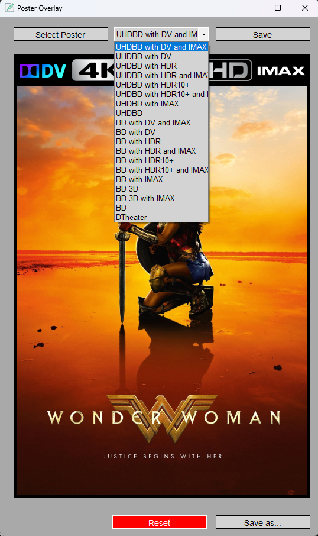

# Poster Overlay GUI

This is a simple Windows Forms application that allows users to add 4K Ultra HD and BluRay Banners to their movie posters with Dolby Vision, IMAX and HDR/HDR10+ labels.
Also DTheater Case was added. The overlays are tailored to fit the Emby Coverart Plugin.

## Screenshots

## Features

- Choose from multiple overlay images for UHD (4k Ultra HD, with HDR, with HDR10+, with DV, With HDR and IMAX, with HDR10+ and IMAX and with DV and Imax)
- Choose from multiple overlay images for BluRay (BluRay, with HDR, with HDR10+, with DV, With HDR and IMAX, with HDR10+ and IMAX and with DV and Imax)
- Preview the combined result
- Save the resulting image as a new file

## How to Use

1. Download and extract the latest Poster Overlay zip file.
2. Run the PosterOverlay.exe file to launch the application.
3. Click on the "Select Poster" button to choose the base image (poster).
4. Use the dropdown box to select an overlay image.
5. Preview the result in the main window.
6. Click "Save Poster" to save the resulting image to your computer.

## Prerequisites

- [.NET 8.0 Runtime](https://dotnet.microsoft.com/download/dotnet/8.0/runtime) is required to run the application. Please download and install the appropriate version for your operating system.

## Contributing

Feel free to contribute by submitting a pull request or opening an issue for any bugs or feature requests.

## License

This project is licensed under the MIT License.
